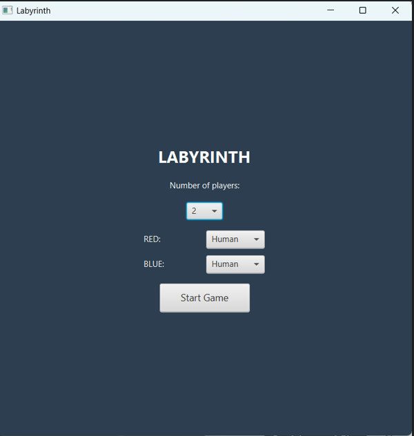
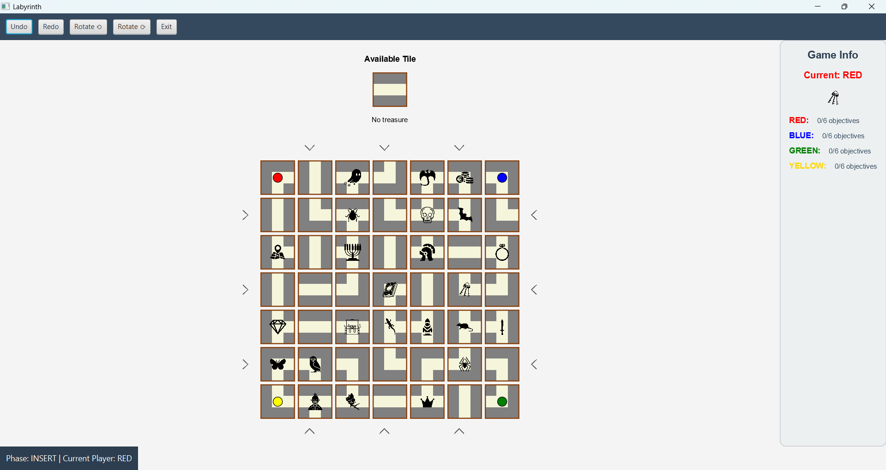

# Labyrinthe

Implémentation en Java du jeu de plateau **Labyrinthe**, réalisée dans le cadre du cours DEV3 (HE2B–ESI, 2ᵉ année). Le projet propose deux interfaces (console et JavaFX) partageant le même modèle, avec une architecture MVC .


---

## Aperçu



---

---

## Fonctionnalités

- Plateau 7x7 avec tuiles fixes et mobiles (formes L, T, I)
- Insertion et rotation de la tuile latérale
- Déplacement des joueurs selon les chemins accessibles (BFS)
- Recherche de trésors (objectifs) dans un ordre défini par joueur
- Undo / Redo
- Joueurs humains ou robots (IA)
- Deux interfaces : console et JavaFX

---

## Architecture

Le projet applique plusieurs design patterns vus en cours :

| Pattern | Où | Rôle |
|---|---|---|
| **MVC** | `model/`, `view/`, `controller/` | Séparation stricte : la vue ne dépend que du Controller, jamais du modèle |
| **Facade** | `GameFacade` | Point d'entrée unique vers le modèle (Board, Player, état de la partie) |
| **Observer** |  `Observer`/`Observable` | Notifications typées (`InsertEvent`, `MoveEvent`, `RotateEvent`, `UndoEvent`, `RedoEvent`) au lieu de transmettre tout le modèle |
| **Command** | `InsertCommand`, `MoveCommand` | Undo/Redo
| **Strategy** | `Robot` | Comportement de l'IA selon son niveau |

### Flux de communication

```
Vue (Console / JavaFX)
    demande via ask*() au
Controller
    appelle la 
GameFacade (Facade + Observable)
   appelle( les classes du model)
Board / Player / CommandManager
```

La vue n'accède **jamais** directement à `GameFacade` : toute lecture passe par le Controller (`askTileAt`, `askCurrentPlayer`, `askGameState`, ...) et toute action par ses méthodes.

---

## Structure du projet

```
src/main/java/g60991/dev3/labyrinthe/
├── Main.java              # Point d'entrée console
├── LabyrintheApp.java     # Point d'entrée JavaFX
├── controller/
├── model/
├── view/

```

---

## Installation et lancement

### Prérequis

- Java 23
- Maven

### Compiler

```bash
mvn clean install
```

### Lancer la version console
Ouvre Main.java et clique sur le triangle à côté de la méthode main (ou clic droit  Run).

### Lancer la version JavaFX

Dans le panneau Maven (à droite de l'IDE) : déplie Plugins > javafx, puis double-clique sur javafx:run.

*(suppose que `LabyrintheApp` — le point d'entrée JavaFX — est configuré comme main class de `javafx:run` dans ton `pom.xml`)*

---

##  Commandes (console)

| Commande | Description |
|---|---|
| `insert <row> <col>` | Insérer la tuile latérale à la position donnée |
| `rotate <cw\|ccw>` | Tourner la tuile latérale (horaire / antihoraire) |
| `move <row> <col>` | Déplacer son pion |
| `undo` | Annuler la dernière action |
| `redo` | Refaire l'action annulée |
| `show` | Réafficher le plateau |
| `help` | Afficher l'aide |
| `quit` | Quitter |


## Auteur

Aninia Abla Negue DEV3 2025-2026
